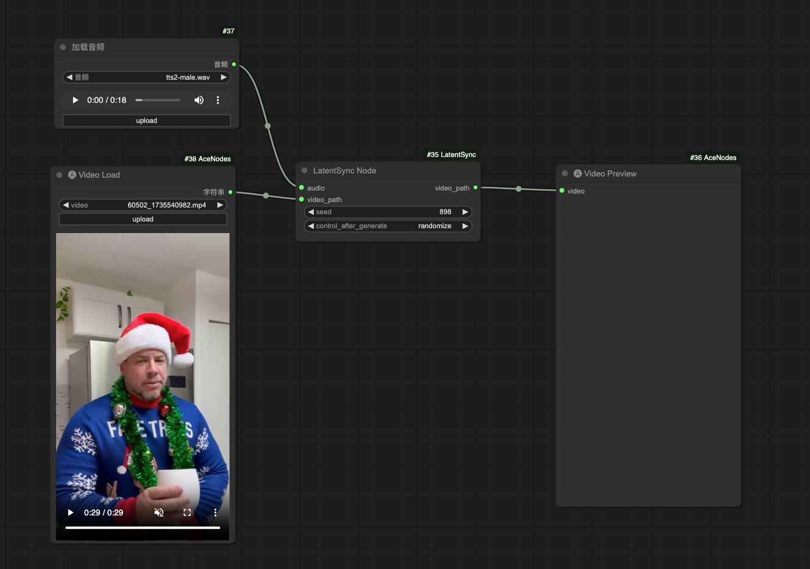

# ComfyUI LatentSync (Unofficial Support)

Unofficial [LatentSync](https://github.com/bytedance/LatentSync) support for [ComfyUI](https://github.com/comfyanonymous/ComfyUI).

## Important Updates
- **2024/12/31:** Added ComfyUI nodes and workflow examples

## Example Workflow
This [workflow](examples/latentsync_comfyui_basic.json) shows the basic usage.

 

## Installation
- Install from ComfyUI Manager (search for `latentsync`, make sure `ffmpeg` is installed)

- Download or git clone this repository into the ComfyUI/custom_nodes/ directory and run:
```
sudo apt install ffmpeg
sudo apt -y install libgl1
pip install -r requirements.txt
```

## Download Checkpoints
All models will be downloaded automatically, if not, try download from [HuggingFace repo](https://huggingface.co/chunyu-li/LatentSync), the checkpoints should appear as follows:

```
./checkpoints/
|-- latentsync_unet.pt
|-- whisper
|   `-- tiny.pt
```
